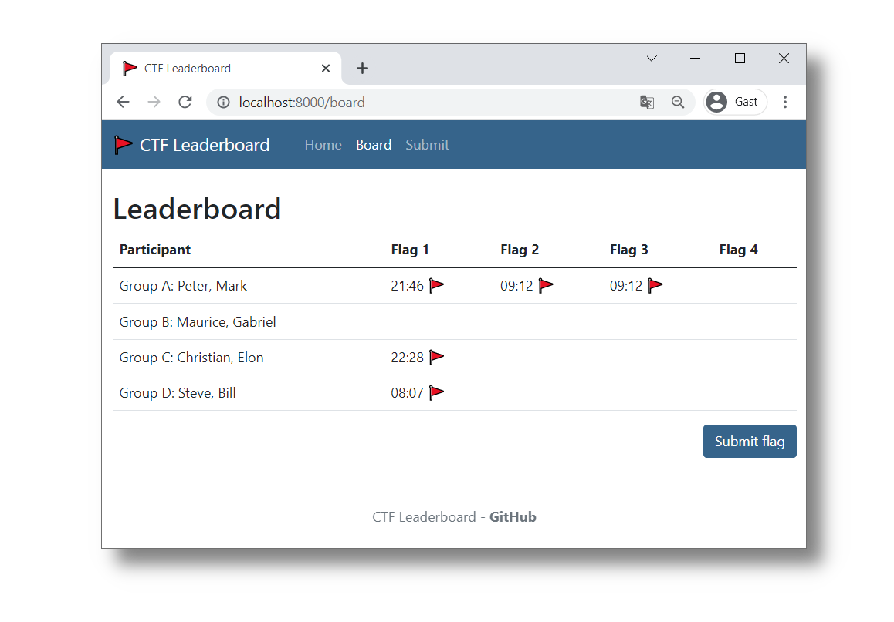

# 🚩 CTF Leaderboard

The goal of this project is to provide a simple web page to allow the participants of an CTF to enter their found flags. Also the live overview over all found flags gives a more competitive feeling to the game.

This app is written using Python 3 and the Django web framework.

## Features

- Participants can submit flags found during the CTF challenge
- Live reload on the leaderboard overview
- Simple administration through the Django admin UI (at `/admin`)
- Custom landing page through the `Content`-model in the DB for instructions, links and screenshots

## Getting started

Create and activate a virtual environment for the app:

    $ python3 -m venv venv
    $ source venv/bin/activate

Install all the necessary dependencies:

    $ python3 -m pip install -r requirements.txt

Copy the `.env.dist` file to a `.env` file and make suitable adjustments (`SECRET_KEY` is important).

Create the database through migration and create a superuser for the admin UI (at `/admin`):

    $ python3 manage.py migrate
    $ python3 manage.py createsuperuser
    $ python3 manage.py collectstatic

Run the server:

    $ python3 manage.py runserver

**Participant-Name-Format** (`name` e.g. `"Group B"` in the screenshot): max. 20 chars  
**Name-Format** (`custom_name` e.g. `"Maurice, Gabriel"` in the screenshot): max. 40 chars `[a-zA-Z0-9_ ,]*`  
**Flag-Format** (`secret`): max. 40 chars `[a-zA-Z0-9_]+`  

## Feature ideas

This is a list of features some users requested but still need to be implemented. Feel free to implement one of them and submit a pull request. Thank you! Hint: we are roughly following the PEP 8 guideline using `autopep8`.

- Crown the winner of the CTF who first found all the flags
- Allow the creation of multiple pages (not only one homepage)
- Enable multiple simultaneous CTFs through a list of available CTFs or unique URLs
